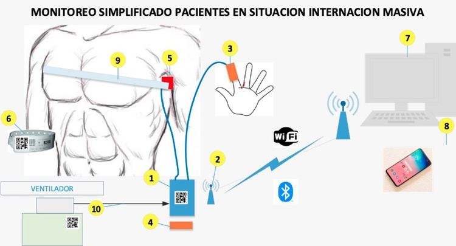

# MoSimPa

Monitoreo Simplificado de Pacientes en situación de internación masiva - MoSimPa (https://mosimpa.gitlab.io/)

Esta aplicación permite conectarse a un Broker MQTT y recibir los signos vitales de pacientes internados.

[Infobae Articulo](https://www.infobae.com/coronavirus/2020/05/14/el-ingenioso-desarrollo-argentino-para-evitar-que-medicos-y-enfermeros-se-contagien-de-coronavirus-y-supervisen-pacientes-a-distancia/)

# Architecture

MoSimPa Android App  was designed with clean architecture implemented the S.O.L.I.D. principles.

## Layers
- Data
- Domain
- Presentation

## Libraries

- Flow
- LiveData
- Navigation Component
- Room
- Dagger2
- Corutines
- Lifecycle
- GSON
- Paho MQTT Client
- MPAndroidChart

# Screen capture

